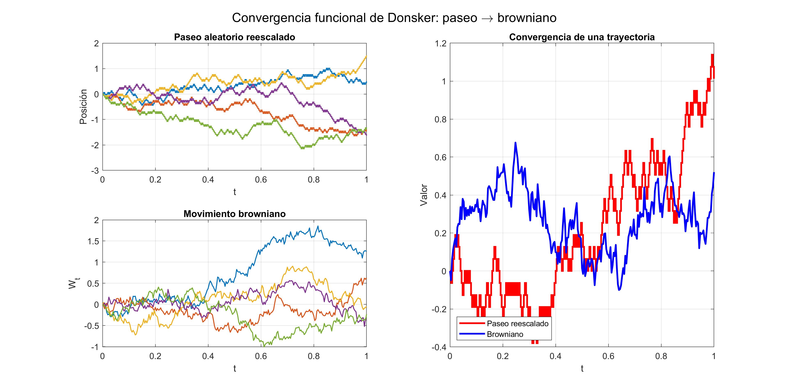
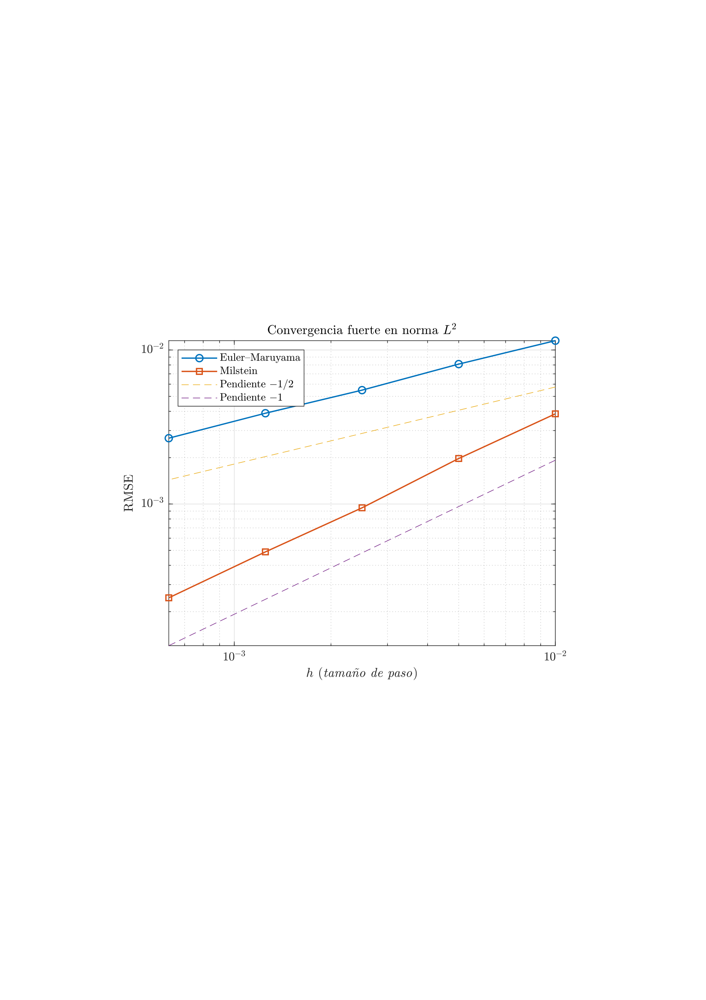
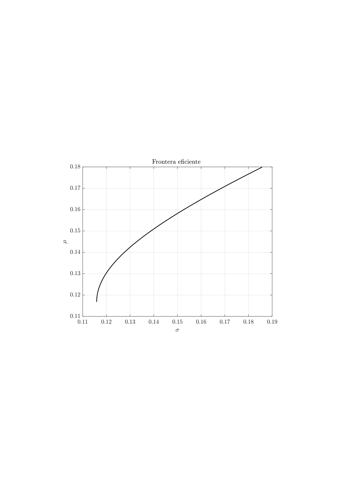
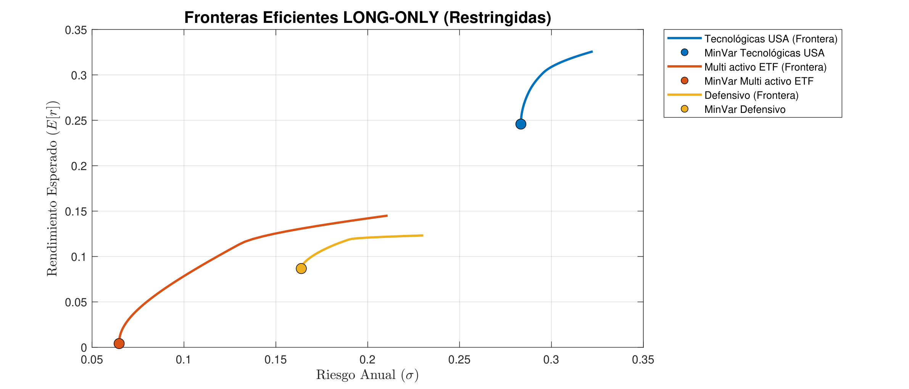

# Quantitative Finance – TFG (Mathematical Methods in Quantitative Finance)

This repository contains the core code developed for my undergraduate thesis (TFG) in **Mathematics**, focused on **stochastic modeling and numerical methods in quantitative finance**. The project covers:  
(i) discrete-time approximation of Brownian motion,  
(ii) numerical simulation of SDEs (Euler–Maruyama and Milstein),  
(iii) basic Monte Carlo techniques in pricing contexts, and  
(iv) mean–variance portfolio optimization (efficient frontier, long-only constraints).

The implementation is mainly in **MATLAB**, with a small **Python** component.

---

## Contents

### 1) Random walk vs. Brownian motion
- Discrete-time random walk as an approximation to Brownian motion.
- Visualization and basic empirical checks consistent with the scaling limit intuition.

Files:
- [`scripts/random_walk_vs_brownian_motion.m`](scripts/random_walk_vs_brownian_motion.m)
- [`scripts/random_walk_vs_brownian_motion.py`](scripts/random_walk_vs_brownian_motion.py) (Python version)

### 2) Euler–Maruyama vs. Milstein (SDE simulation)
- Simulation of SDE trajectories under two classic discretization schemes.
- Comparison of numerical behavior and convergence intuition.

Files:
- [`scripts/euler_maruyama_vs_milstein.m`](`scripts/euler_maruyama_vs_milstein.m`)

### 3) Efficient frontier example (Markowitz)
- Mean–variance optimization and efficient frontier construction on market data.
- Emphasis on constraints and numerical stability considerations.

Files:
- [`scripts/efficient_frontier_example.m`](`scripts/efficient_frontier_example.m`)

### 4) Data download utility
- Helper to retrieve or preprocess historical price series used in examples.

Files:
- [`scripts/DownloadDiaryPrices.m`](`scripts/DownloadDiaryPrices.m`) (folder)

### 5) Black–Scholes / martingale viewpoint (conceptual + numerical support)
- Supporting code and notes connected to the Black–Scholes framework and martingale arguments.

Files:
- [`scripts/black_scholes_martingale.m`](`scripts/black_scholes_martingale.m`) (file/folder)

### 6) Long-only portfolio optimization
- Constrained portfolio allocation under long-only constraints.

Files:
- [`scripts/portfolio_long_only.m`](`scripts/portfolio_long_only.m`) (file/folder)

---

## Results

### Donsker: Random Walk → Brownian Motion

### Strong convergence: Euler–Maruyama vs Milstein

### Efficient frontier (synthetic example)

### Black–Scholes: trajectories, martingale, terminal lognormality

### Efficient frontiers (Long-only)

